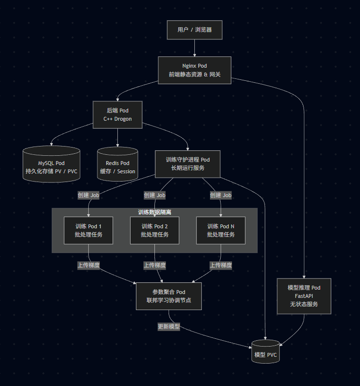

# 云计算和大数据概论作业（基于云的博客搭建和模型训练推理）

## 基本介绍

使用联邦学习的方法，训练了一个基于LSTM模型架构和pytorch框架的情感识别（文本分类模型），然后使用了fastapi将接口暴露出来，做成了博客附属的一个情感识别小工具，然后搭建了一个博客，前端使用vue.js + javascript构建，后端使用c++以及drogon框架构建，后端数据库使用mysql和redis，mysql作为主要存储，redis用来临时缓存数据，主要用来保存用户登陆信息和相关评论。（为什么想到做一个博客呢。其实我是像既然我们都已经创建了自己的服务器了，那么我们期末展示的内容其实就可以之间放到服务器上，那么就可以直接打开网页开始讲解自己做的内容了。）所以最后总共需要用到

1. 一个推理pod用来提供推理接口
2. 一个博客pod用来提供博客后端存储相关接口
3. 多个nginx pod用来展示前端页面和路由后端接口，同时可以实现负载均衡
4. 一个mysql pod和一个redis pod用来运行相关基础设施服务
5. 训练过程使用两个pod进行训练，然后使用联邦学习使用一个pod进行参数聚合

整个项目在bloginfer这一个命名空间下进行。

## 目录及相关介绍

1111

## 具体过程

(记得在改完相关文件后要重新创建configmap)

1. 使用`kubectl create namespace bloginfer`命令创建命名空间

